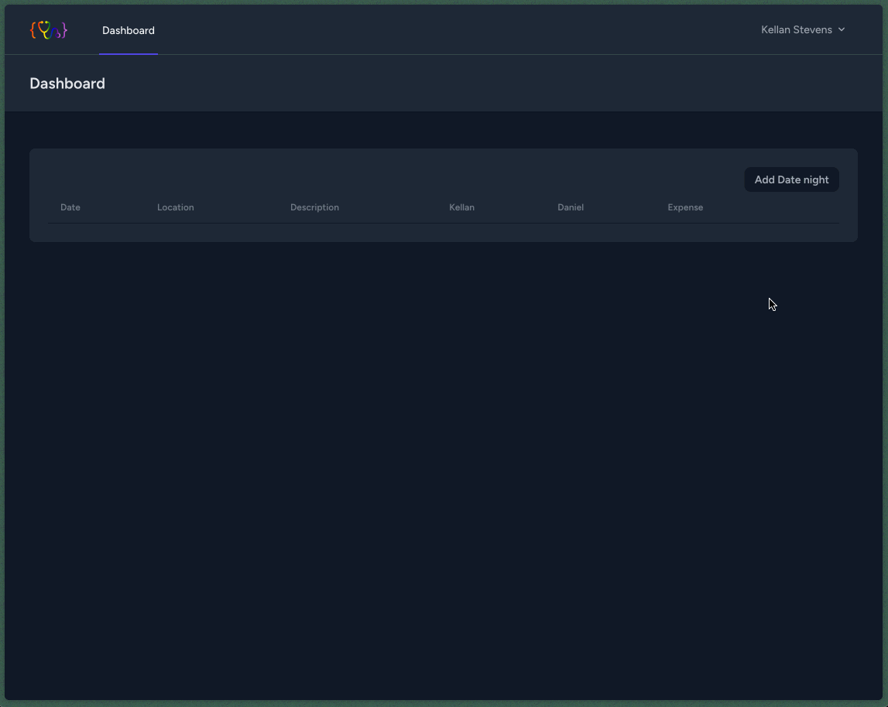

# Romance Registry

<p style="text-align: center;">
    
</p>

## About

I set out to create a simple web application that allows my partner and I, to keep track of the romantic dates we go on. We started keeping track of this information in a Google spreadsheet, then Apple Numbers, then Apple Notes... (and so on and so forth).
You can see, we tried everything, but nothing seemed to give us exactly what we needed. So, then I thought, "Why not just build it myself?" And so, here we are.
I wanted to challenge myself to build this project using tools and technologies that I am not familiar with. I wanted to learn something new and have fun doing it.
I hope you enjoy the project and find it useful. If you have any questions, comments, or suggestions, please feel free to reach out to me. I would love to hear from you.

## Technologies

- [Laravel](https://laravel.com/)
- [Tailwind CSS](https://tailwindcss.com/)
- [Alpine.js](https://alpinejs.dev/)
- [Livewire](https://laravel-livewire.com/)
- [Blade](https://laravel.com/docs/8.x/blade)
- [Breeze](https://laravel.com/docs/8.x/starter-kits#laravel-breeze)
- [MySQL](https://www.mysql.com/)
- [GitHub Actions](https://github.com/features/actions)


## Features I Plan for this Project

- [x] Create a new date
- [x] Edit a date
- [x] Delete a date
- [x] View all dates w/ relevant data
- [x] Add a rating to a date per person
- [x] Edit a rating
- [x] Delete a rating
- [x] Add an expense to a date
- [x] Edit an expense
- [x] Delete an expense
- [ ] Total expenses for budgeting
- [x] Add authorizations for users
- [ ] Add a photo to a date
- [ ] Add a "Remember this date" feature
- [ ] Add a "Favorite this date" feature
- [ ] Add an anniversary countdown feature

## Demo



## Installation

```
To be added...
```

## License

This project is open-sourced software licensed under the [MIT license](https://opensource.org/licenses/MIT).
